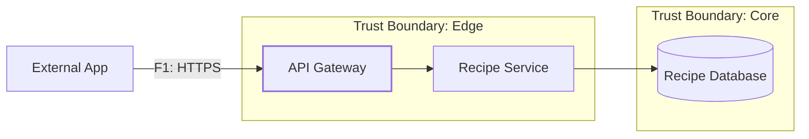

```mermaid
flowchart LR
  A[External App] -->|F1: HTTPS| GW[API Gateway]
  subgraph Edge[Trust Boundary: Edge]
    GW --> SVC[Recipe Service]
  end
  subgraph Core[Trust Boundary: Core]
    SVC --> DB[(Recipe Database)]
  end
  style GW stroke-width:2px
```
